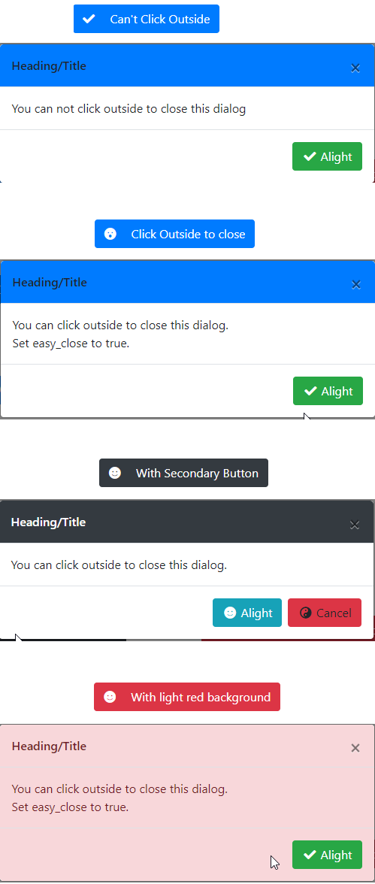

# jQuery-Modal-Dialog
Dialog that is easy to use and easy to customize

## How to show
```javascript
// Button 1
$("#btn-no-outside-click").on("click", function () {
    $.ModalDialog({
        "title": "Heading/Title",
        "primary_button_text": "Alight",
        "modal_body": "You can not click outside to close this dialog",
        "easy_close": false
    })
})
```

**Default Options**
```javascript
"modal_class": null,
"header_class": "bg-primary",
"title": "Modal Dialog",
"title_class": null,
"close_button_text": "",
"primary_button_text": "OK",
"primary_button_class": "btn-success",
"primary_fa": "check",
"secondary_button_text": null,
"secondary_button_class": "btn-success",
"secondary_fa": "window-close",
"modal_body": "",
"modal_body_class": null,
"footer_class": null,
"easy_close": false
```

**Examples**

